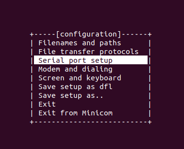
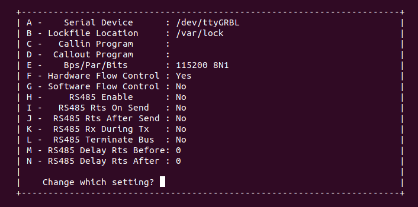
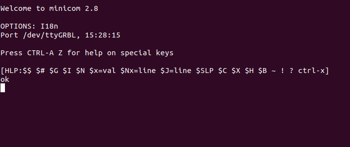

# grblHAL SIM 

## What can you do with grblHAL Sim? 

 - Simply check out how grblHAL works without needing a microcontroller.
 - Visualize a g-code program by having the simulator parse and execute to a GUI. Fluctuations in feed rates by the acceleration planner can be viewed as well.
 - A powerful debugging tool for development.
 - The microcontroller peripherals are emulated using structs and functions. These could be written to do whatever you need. For example, output simulated step pulses over time and examine its performance.
 
 ## How do you compile grblHAL Sim?

Use the [Web Builder](http://svn.io-engineering.com:8080/?driver=Simulator) for x86 Linux or Windows, or follow these instructions:

Clone this repositoriy 

```
$ git clone --recurse-submodules <url> 
```  

Create a build directory

```
$ cd Simulator
$ mkdir build 
```

Run cmake and create the binaries
```
$ cd build
$ cmake ..
$ make
```

 ## Debugging on LINUX
 On Linux, hook it to a fake serial port (/dev/ttygrblHAL) and use it to test your grblHAL interface software:

 ``` 
 socat PTY,raw,link=/dev/ttyGRBL,echo=0,group-late=dialout,mode=660 "EXEC:'./grblHAL_sim -n -s step.out -b block.out',pty,raw,echo=0" 
 ```

 After this command, the simulator is running and has a serial connection to `/dev/ttyGRBL`. 

 With [Minicom](https://wiki.emacinc.com/wiki/Getting_Started_With_Minicom) you can read and write to the serial connection. Let's take a closer look.

First start minicom with 
```
$ minicom -s
```
in your terminal. Then you will see a configuration window and select the serial port setup.

 

In the setup press the A key and change the serial device to GRBL.

 

 Now exit the setup and configuration and you will see the connection to our grblHAL simulator. Press `$ + Return` for your first help command.

 


### Realtime modifications:

  Now simulates microcontroller peripherals in separate thread.  Runs in *aproximate* realtime.  Emphasis on  * **Approximate** *.  Work is underway to speed it up.


## Validator

Run 
```
$ grblHAL_validator GCODE_FILE
``` 
to validate that grblHAL will parse your GCODE with no errors.

## Raw telnet connection
**NEW** 

Use the `-p <port>` command line argument to start a raw telnet server for communication instead of using serial simulation via stdin/stdout. This frees up stdin for input to trigger hardware events such as feed hold, cycle start or setting/clearing limit switches. 

## Maintainers
- Created by Jens Geisler, Adam Shelly

- Modified by Terje Io for grblHAL. Original implementation for Grbl can be found [here](https://github.com/grbl/grbl-sim).

This repository contains an experimental grblHAL simulator that compiles the main grblHAL source code into a wrapped executable for use on a computer. No microcontroller required. When the executable is run, the user should be able to interact with the grblHAL simulator as if connected to a microcontroller board with grblHAL.

*WARNING: grblHAL Sim is under heavy development.* So many things may not work, or respond in ways unexpected. At the moment, this code is a proof-of-concept.

---
2023-09-27
